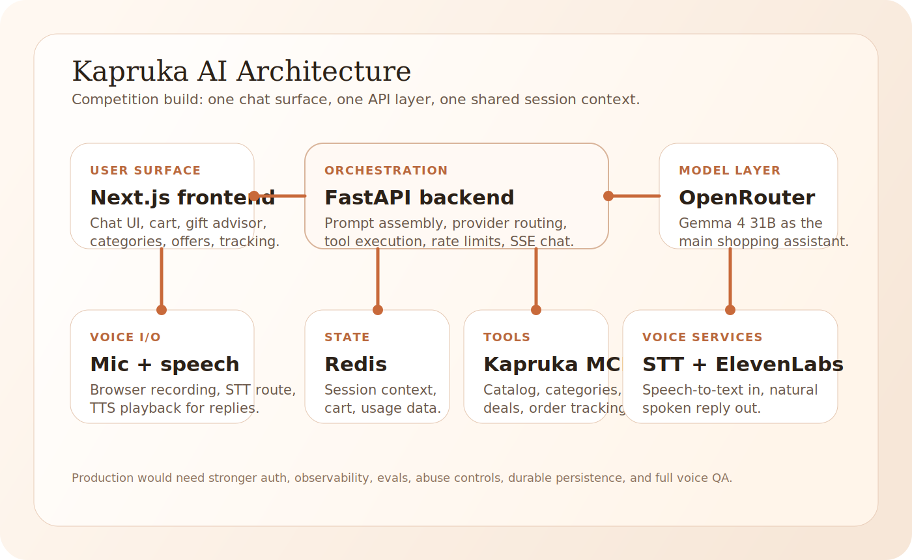

<p align="center">
  
</p>

<h1 align="center">Kapruka AI Shopping Assistant</h1>

<p align="center">
  Multilingual MCP-powered shopping assistant built for the
  <a href="https://www.kapruka.com/contactUs/agentChallenge.html">Kapruka Agent Challenge</a>.
</p>

<p align="center">
  <a href="https://github.com/HimanM">
    
  </a>
  <a href="https://www.linkedin.com/in/HimanM">
    
  </a>
  
  
</p>

<p align="center">
  
</p>

## Overview

Kapruka AI is a shopping assistant that lets a customer search, browse, track, and move toward checkout from a single conversational workspace.

It combines:

- a premium chat-first frontend
- MCP tool orchestration for catalog and order workflows
- multilingual prompt handling for English, Sinhala, Tamil, Singlish, and Tanglish
- cart, checkout, order tracking, and voice interaction in one flow

> [!WARNING]
> This demo currently uses the free `google/gemma-4-31b-it` route through OpenRouter. It is cost-efficient and strong for this use case, but it can feel slower than paid inference. Please keep that in mind during evaluation.

## Key Features

- Natural-language product discovery through the Kapruka MCP tool layer
- Guided gift advisor flow with conversational follow-ups
- Dedicated order tracking flow
- Category browsing and deals views integrated into the assistant workspace
- Cart and checkout state that survives short refresh or return windows
- Voice input and spoken replies
- UI support messaging for English, Sinhala, Tamil, Singlish, and Tanglish
- Mobile-first responsive interface with dark and light presentation

## Architecture

### Frontend

`frontend/`

- Next.js and React app
- chat workspace, category browsing, deals, cart, checkout, and voice controls
- responsive desktop and mobile UI

### Backend

`backend/`

- FastAPI API layer
- prompt assembly and model routing
- MCP orchestration
- rate limiting, cart state, session state, order tracking, STT, and TTS

### Docs

`docs/`

- deployment notes
- feature and planning docs
- architecture assets and support material

## Technology Stack

| Technology | Role | Why it helps |
| --- | --- | --- |
| Next.js + React | Frontend application | Fast UI iteration, server rendering where useful, and straightforward Vercel deployment |
| Tailwind CSS | Design system foundation | Keeps the interface consistent while still allowing fast refinement |
| FastAPI | Backend API | Clean async endpoints for chat, tracking, cart, speech, and checkout orchestration |
| Redis | Session and cart persistence | Keeps short-lived state off the browser and supports session recovery |
| OpenRouter | LLM gateway | One integration layer for primary and backup model control |
| `google/gemma-4-31b-it` | Main assistant model | Strong multilingual quality, good instruction following, and better cost efficiency for this challenge |
| Kapruka MCP | Commerce tool layer | Structured access to products, categories, deals, tracking, and ordering tools |
| ElevenLabs | Voice output | Higher quality spoken responses than generic browser TTS |
| Groq / OpenRouter STT | Speech-to-text | Turns voice input into normal chat input |
| Vercel | Deployment target | Simple frontend deployment and challenge-friendly delivery |

## Why We Chose Gemma 4 31B

We selected `google/gemma-4-31b-it` because it fit the actual challenge behavior better than several larger or more expensive options we tested.

- It is a highly capable open-weight model from Google DeepMind.
- It can be self-hosted in other setups, but for this challenge we route it through OpenRouter because the app is deployed in a web-first Vercel environment.
- It performed especially well across English, Singlish, Tanglish, Sinhala-leaning romanized text, and Tamil-leaning romanized text.
- It gave us a strong balance of warmth, instruction-following, multilingual handling, and cost efficiency for a shopping assistant with many short conversations.
- The current demo uses the free route, which is slower, but it kept experimentation practical during the competition build.

## Local Development

### Backend

```bash
cd backend
python -m uvicorn main:app --reload --port 8000
```

### Frontend

```bash
cd frontend
npm install
npm run dev
```

### Local URLs

- Frontend: `http://localhost:3000`
- Backend: `http://127.0.0.1:8000`

## Environment

- Local development reads from the repo root `.env`
- Deployment-friendly placeholders live in `.env.example`
- Vercel deployment notes live under [`docs/`](./docs)

## Verification

```bash
cd frontend && npm run lint
cd frontend && npm run build
cd backend && python -m pytest
```

## Production Note

This repository is a competition submission and proof of capability, not a production-complete commerce platform.

Before taking this further into production, we would still want to strengthen:

- authentication and user identity
- abuse protection and tighter spend controls
- prompt and model evaluation workflows
- observability and conversation tracing
- durable persistence around checkout and order state
- multilingual speech QA across more real devices
- analytics, privacy, consent, and compliance review

## Author

Built by [HimanM](https://github.com/HimanM)

- GitHub: [github.com/HimanM](https://github.com/HimanM)
- LinkedIn: [linkedin.com/in/HimanM](https://www.linkedin.com/in/HimanM)
